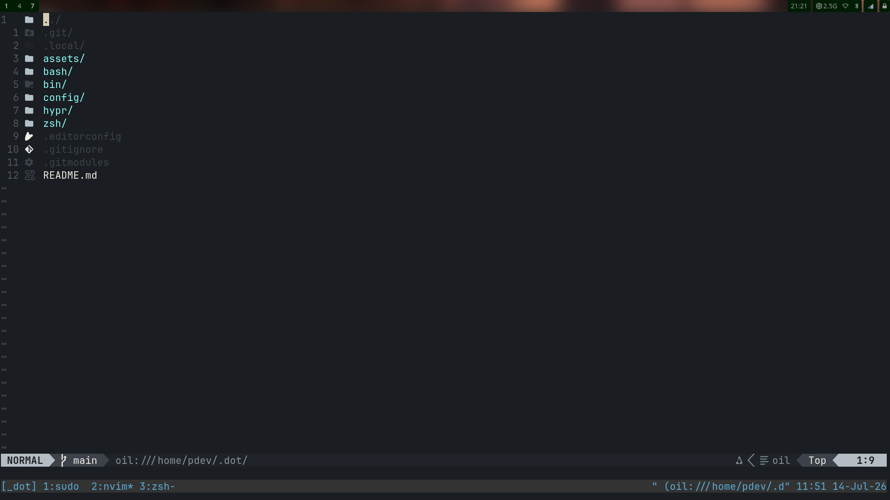
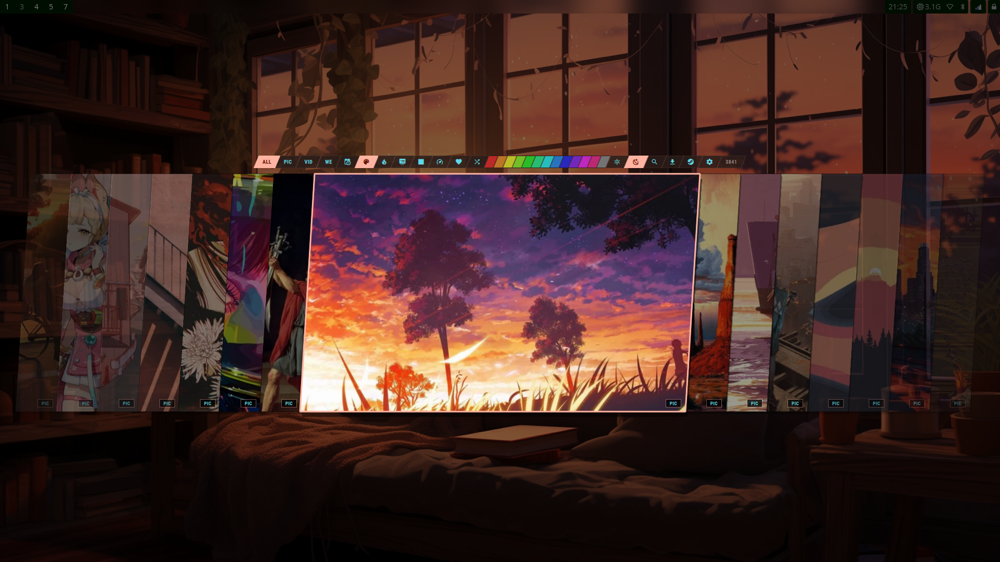
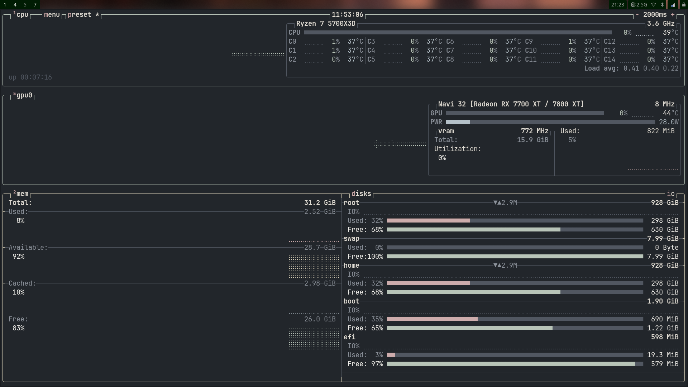

# JET Engine

My New desktop look will be more work oriented
starting from this commit [e98bea8]

> For actual productivity you should keep animations in hyprland config as `enable = no`

## Installation
```bash
git clone --recursive https://github.com/PyDevC/.dot
```

## Key FEATURES
- [x] Eye pleasing
- [x] Ease of use
- [x] Less Search Fatigue
- [x] Faster loading
- [x] Open Source softwares And Free

## What my system looks like?





## NEW FEATURES TODO

- [ ] Add Docs using sphinx documentation builder
- [ ] Software compatiblity
- [ ] Stress Handling
- [ ] Add only default keybindings for the things that you might use in a server
- [ ] Make a Widget bar using quickshell
- [ ] Make a SDDM login screen.
- [ ] Move it to quickshell, make it the greatest rice ever
